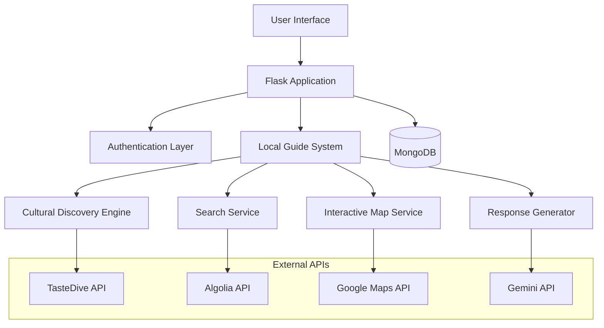

# Design Document: Local Guide Revamp

## Overview

The Local Guide Revamp transforms Taste & Trails Korea into an authentic Korean cultural assistant by replacing legacy APIs, redesigning the user interface, and enhancing the AI-powered recommendation system. The system acts as a knowledgeable local guide, providing culturally authentic recommendations through a combination of TasteDive's cultural discovery engine, Algolia's fast search capabilities, and Gemini's natural language generation.

The architecture follows a service-oriented approach where each external API serves a specific purpose: TasteDive provides cultural similarity recommendations, Algolia handles fast local search and filtering, Google Maps provides geographic context, and Gemini polishes responses for natural conversation flow.

## Architecture

### High-Level Architecture



### Service Layer Architecture

The application follows a layered architecture with clear separation of concerns:

1. **Presentation Layer**: Jinja2 templates with Seoul-inspired UI design
2. **Application Layer**: Flask routes handling HTTP requests and responses
3. **Business Logic Layer**: Local Guide System orchestrating recommendations
4. **Service Layer**: Individual API integrations with fallback mechanisms
5. **Data Layer**: MongoDB for user profiles and cached recommendations

### API Integration Strategy

Each external API is wrapped in a service class with the following patterns:
- **Circuit Breaker**: Prevent cascading failures when APIs are down
- **Retry Logic**: Exponential backoff for transient failures
- **Fallback Mechanisms**: Local knowledge when external services fail
- **Rate Limiting**: Respect API quotas and prevent abuse
- **Caching**: Store frequently accessed data to reduce API calls

## Components and Interfaces

### Local Guide System

The core orchestration component that coordinates all services to provide authentic Korean cultural recommendations.

```python
class LocalGuideSystem:
    def __init__(self, cultural_engine, search_service, map_service, response_generator):
        self.cultural_engine = cultural_engine
        self.search_service = search_service
        self.map_service = map_service
        self.response_generator = response_generator
        self.local_knowledge = KoreanCulturalContext()
    
    def get_recommendation(self, user_query, user_profile):
        # Orchestrate services to generate culturally authentic recommendations
        pass
    
    def handle_fallback(self, service_failures):
        # Provide local knowledge when external services fail
        pass
```

### Cultural Discovery Engine

Integrates with TasteDive API to find culturally similar experiences and entertainment.

```python
class CulturalDiscoveryEngine:
    def __init__(self, api_key):
        self.api_key = api_key
        self.base_url = "https://tastedive.com/api/similar"
    
    def find_similar_experiences(self, interests, content_type="all"):
        # Query TasteDive for similar cultural content
        pass
    
    def get_korean_cultural_matches(self, user_interests):
        # Filter results for Korean cultural relevance
        pass
```

### Search Service

Provides fast, location-based search using Algolia with geographic filtering.

```python
class SearchService:
    def __init__(self, app_id, api_key):
        self.client = algoliasearch.Client(app_id, api_key)
        self.index = self.client.init_index('korean_places')
    
    def search_places(self, query, location=None, place_type=None):
        # Fast search with geographic and type filtering
        pass
    
    def get_nearby_amenities(self, location, radius=1000):
        # Find restaurants, hotels, transport near location
        pass
```

### Interactive Map Service

Manages Google Maps integration with Korean cultural context.

```python
class InteractiveMapService:
    def __init__(self, api_key):
        self.api_key = api_key
        self.places_client = googlemaps.Client(key=api_key)
    
    def get_place_details(self, place_id):
        # Get detailed place information with cultural context
        pass
    
    def find_nearby_places(self, location, place_type):
        # Find places near location with Korean cultural relevance
        pass
```

### Response Generator

Uses Gemini API to create natural, conversational responses with Korean cultural context.

```python
class ResponseGenerator:
    def __init__(self, api_key):
        self.api_key = api_key
        self.model = genai.GenerativeModel('gemini-pro')
    
    def generate_response(self, recommendations, user_context, cultural_context):
        # Generate natural language response with Korean cultural insights
        pass
    
    def format_local_guide_response(self, data):
        # Format response as authentic local guide
        pass
```

### User Profile Manager

Handles user authentication, preferences, and personalization data in MongoDB.

```python
class UserProfileManager:
    def __init__(self, mongo_client):
        self.db = mongo_client.taste_trails_korea
        self.users = self.db.users
    
    def create_user_profile(self, user_data):
        # Create new user with preferences and restrictions
        pass
    
    def update_user_history(self, user_id, visited_place, rating):
        # Track user visits and preferences for personalization
        pass
    
    def get_personalized_preferences(self, user_id):
        # Generate recommendation weights based on user history
        pass
```

## Data Models

### User Profile Schema

```python
user_schema = {
    "_id": ObjectId,
    "username": str,
    "email": str,
    "password_hash": str,  # PBKDF2-SHA256
    "created_at": datetime,
    "preferences": {
        "food_restrictions": [str],  # ["vegetarian", "no_spicy", "halal"]
        "interests": [str],  # ["history", "nightlife", "shopping", "nature"]
        "cultural_preferences": [str],  # ["traditional", "modern", "k-pop", "food"]
        "budget_range": str,  # "budget", "mid-range", "luxury"
        "travel_style": str  # "solo", "couple", "family", "group"
    },
    "history": {
        "visited_places": [{
            "place_id": str,
            "name": str,
            "location": {"lat": float, "lng": float},
            "visited_date": datetime,
            "rating": int,  # 1-5
            "notes": str
        }],
        "favorites": [{
            "place_id": str,
            "name": str,
            "category": str,
            "added_date": datetime
        }],
        "search_history": [{
            "query": str,
            "timestamp": datetime,
            "results_clicked": [str]
        }]
    },
    "personalization": {
        "recommendation_weights": {
            "food": float,
            "culture": float,
            "nightlife": float,
            "shopping": float,
            "nature": float
        },
        "preferred_neighborhoods": [str],  # ["hongdae", "myeongdong", "itaewon"]
        "last_recommendation_update": datetime
    }
}
```

### Place Data Schema

```python
place_schema = {
    "_id": ObjectId,
    "place_id": str,  # Google Places ID
    "name": str,
    "category": str,  # "restaurant", "attraction", "hotel", "transport"
    "location": {
        "lat": float,
        "lng": float,
        "address": str,
        "neighborhood": str  # "hongdae", "myeongdong", etc.
    },
    "details": {
        "description": str,
        "cultural_context": str,  # Local insights and cultural significance
        "rating": float,
        "price_level": int,  # 1-4
        "opening_hours": [str],
        "contact": {
            "phone": str,
            "website": str
        }
    },
    "cultural_tags": [str],  # ["traditional", "modern", "k-pop", "street-food"]
    "amenities": [str],  # ["wifi", "english-menu", "credit-cards"]
    "algolia_indexed": bool,
    "last_updated": datetime
}
```

### Recommendation Cache Schema

```python
recommendation_cache_schema = {
    "_id": ObjectId,
    "cache_key": str,  # Hash of query parameters
    "user_id": ObjectId,
    "query_type": str,  # "cultural_discovery", "local_search", "personalized"
    "recommendations": [{
        "place_id": str,
        "relevance_score": float,
        "cultural_match_score": float,
        "personalization_score": float,
        "source": str  # "tastedive", "algolia", "local_knowledge"
    }],
    "created_at": datetime,
    "expires_at": datetime,
    "hit_count": int
}
```

## Correctness Properties

*A property is a characteristic or behavior that should hold true across all valid executions of a system-essentially, a formal statement about what the system should do. Properties serve as the bridge between human-readable specifications and machine-verifiable correctness guarantees.*

Based on the prework analysis, I've identified the following testable properties. After reviewing all properties for redundancy, I've consolidated similar properties and eliminated those that would be redundant:

### Cultural Authenticity Properties

**Property 1: Korean Cultural Context Integration**
*For any* user recommendation request, the response should contain Korean cultural context elements from product.md including cultural norms, regional knowledge, or local slang
**Validates: Requirements 1.1, 1.2**

**Property 2: Authentic Experience Prioritization**
*For any* activity recommendation, authentic local experiences should rank higher in relevance scores than generic tourist attractions
**Validates: Requirements 1.3**

**Property 3: Food Recommendation Cultural Context**
*For any* food recommendation, the response should include cultural context about dining etiquette, social aspects, or cultural significance
**Validates: Requirements 1.4**

**Property 4: Neighborhood-Specific Insights**
*For any* location query about Seoul neighborhoods (Hongdae, Myeongdong, Itaewon, Gangnam), the response should contain neighborhood-specific cultural insights
**Validates: Requirements 1.5**

### Cultural Discovery Properties

**Property 5: Korean Cultural Similarity Matching**
*For any* cultural activity input, the Cultural Discovery Engine should return similar Korean cultural experiences that maintain cultural authenticity
**Validates: Requirements 2.1, 2.4**

**Property 6: Korean Entertainment Recommendation Coverage**
*For any* entertainment recommendation request, the system should suggest Korean content across all media types (films, TV shows, music, books)
**Validates: Requirements 2.2**

**Property 7: Cultural Relationship Mapping**
*For any* visited place, the system should recommend culturally related locations and activities based on cultural themes and connections
**Validates: Requirements 2.3**

### Search and Performance Properties

**Property 8: Search Response Time Performance**
*For any* place search query, the Search Service should return results within 200ms
**Validates: Requirements 3.1**

**Property 9: Geographic Boundary Accuracy**
*For any* area-based search filter, all returned results should fall within the correct geographic boundaries of the specified area
**Validates: Requirements 3.2**

**Property 10: Search Result Completeness**
*For any* search result, the response should include essential information (ratings, location, cultural context) and support filtering by place types (restaurants, attractions, hotels, transport)
**Validates: Requirements 3.3, 3.4**

### User Personalization Properties

**Property 11: User Profile Data Completeness**
*For any* user account creation, the system should store all preference categories (food restrictions, interests, cultural preferences)
**Validates: Requirements 4.1**

**Property 12: User History Tracking and Influence**
*For any* user interaction (visiting places, marking favorites), the system should track the data and reflect it in future recommendation personalization
**Validates: Requirements 4.2, 4.3, 4.4**

**Property 13: Profile Update Immediate Effect**
*For any* user profile update, the change should immediately affect the next recommendation generation
**Validates: Requirements 4.5**

### Map Integration Properties

**Property 14: Geographic Positioning Accuracy**
*For any* Korean attraction displayed on the map, the geographic coordinates should accurately represent the location within acceptable GPS precision
**Validates: Requirements 5.1**

**Property 15: Nearby Amenity Discovery**
*For any* selected location, the system should display nearby amenities (restaurants, hotels, transport) with cultural context
**Validates: Requirements 5.2, 5.3**

**Property 16: Map Display Optimization**
*For any* multiple location display, the system should use appropriate clustering and zoom levels for optimal user experience
**Validates: Requirements 5.5**

### Response Generation Properties

**Property 17: Korean-Informed Language Patterns**
*For any* generated response, the language should contain Korean-informed elements and maintain consistency with the local guide persona
**Validates: Requirements 6.1, 6.3**

**Property 18: Response Structure and Cultural Context**
*For any* recommendation response, the information should be clearly structured and include relevant cultural context
**Validates: Requirements 6.2**

### UI and Security Properties

**Property 19: UI Consistency Across Pages**
*For any* page navigation, the visual design elements should maintain consistency with the Seoul night theme and use Font Awesome icons with CSS3 styling
**Validates: Requirements 7.2, 7.3**

**Property 20: Responsive Design Maintenance**
*For any* device screen size, the UI should maintain responsive design principles and proper layout
**Validates: Requirements 7.5**

**Property 21: Password Security Implementation**
*For any* user account creation, passwords should be hashed using PBKDF2-SHA256 algorithm
**Validates: Requirements 8.1**

**Property 22: Authentication and Session Security**
*For any* user login, credentials should be validated securely, session tokens created, and authentication verified for protected features
**Validates: Requirements 8.2, 8.4**

**Property 23: Configuration Security**
*For any* sensitive configuration, API keys should be loaded from environment variables, not hardcoded in source code
**Validates: Requirements 8.3**

**Property 24: Session Expiration Security**
*For any* expired session, the system should require re-authentication before allowing access to protected features
**Validates: Requirements 8.5**

### System Resilience Properties

**Property 25: Graceful Service Degradation**
*For any* external API unavailability, the system should provide graceful degradation with fallback functionality and maintain core features
**Validates: Requirements 2.5, 3.5, 6.5, 9.1, 9.5**

**Property 26: Error Handling and Recovery**
*For any* API request failure, the system should log errors appropriately, implement exponential backoff retry logic, and handle malformed responses without crashing
**Validates: Requirements 9.2, 9.4**

**Property 27: Rate Limiting Management**
*For any* rate limit exceeded scenario, the system should queue requests and inform users of delays appropriately
**Validates: Requirements 9.3**

### Performance Properties

**Property 28: Page Load Performance**
*For any* page load request, the initial content should render within 2 seconds
**Validates: Requirements 10.1**

**Property 29: Recommendation Generation Performance**
*For any* recommendation processing request, the system should generate responses within 5 seconds
**Validates: Requirements 10.2**

**Property 30: Concurrent User Performance**
*For any* concurrent user load, the system should maintain performance with appropriate resource management
**Validates: Requirements 10.3**

**Property 31: Caching Strategy Effectiveness**
*For any* frequently accessed information, the system should implement intelligent caching strategies to improve response times
**Validates: Requirements 10.4**

**Property 32: Database Query Performance**
*For any* MongoDB operation, the query should execute with sub-second response times
**Validates: Requirements 10.5**

<function_calls>
<invoke name="prework">
<parameter name="featureName">local-guide-revamp

## Error Handling

### API Integration Error Handling

The system implements a comprehensive error handling strategy for all external API integrations:

#### Circuit Breaker Pattern
- **Closed State**: Normal operation, requests pass through
- **Open State**: API failures exceed threshold, requests fail fast
- **Half-Open State**: Limited requests allowed to test API recovery

#### Retry Logic with Exponential Backoff
```python
def retry_with_backoff(func, max_retries=3, base_delay=1):
    for attempt in range(max_retries):
        try:
            return func()
        except (ConnectionError, TimeoutError) as e:
            if attempt == max_retries - 1:
                raise
            delay = base_delay * (2 ** attempt)
            time.sleep(delay)
```

#### Fallback Mechanisms
- **TasteDive Unavailable**: Use local Korean cultural knowledge database
- **Algolia Unavailable**: Fall back to MongoDB text search with basic filtering
- **Google Maps Unavailable**: Use cached location data and static coordinates
- **Gemini Unavailable**: Return structured data without natural language polish

#### Rate Limiting Handling
- **Request Queuing**: Queue requests when rate limits approached
- **User Notification**: Inform users of delays with estimated wait times
- **Priority Queuing**: Prioritize authenticated user requests over anonymous

### Database Error Handling

#### MongoDB Connection Management
- **Connection Pooling**: Maintain connection pool with automatic reconnection
- **Timeout Configuration**: Set appropriate timeouts for read/write operations
- **Replica Set Support**: Configure for high availability with replica sets

#### Data Validation and Integrity
- **Schema Validation**: Validate documents against defined schemas before insertion
- **Unique Constraints**: Enforce uniqueness for usernames and email addresses
- **Referential Integrity**: Maintain consistency between user profiles and history

### User Input Validation

#### Authentication Security
- **Password Strength**: Enforce minimum password requirements
- **Input Sanitization**: Sanitize all user inputs to prevent injection attacks
- **Session Management**: Implement secure session handling with proper expiration

#### Search Query Validation
- **Query Length Limits**: Prevent excessively long search queries
- **Special Character Handling**: Properly escape special characters in search terms
- **Geographic Bounds**: Validate location coordinates are within reasonable ranges

## Testing Strategy

### Dual Testing Approach

The testing strategy combines unit testing and property-based testing to ensure comprehensive coverage:

#### Unit Testing
Unit tests focus on specific examples, edge cases, and integration points:
- **Authentication flows**: Login, logout, session management
- **API integration points**: Mock external services for predictable testing
- **Database operations**: CRUD operations with test data
- **Error conditions**: Specific error scenarios and edge cases
- **UI components**: Template rendering and form validation

#### Property-Based Testing
Property tests verify universal properties across all inputs using **Hypothesis** for Python:
- **Minimum 100 iterations** per property test for thorough coverage
- **Random input generation** to discover edge cases automatically
- **Cultural authenticity validation** across diverse input combinations
- **Performance property verification** under various load conditions
- **Security property validation** with malicious input patterns

#### Property Test Configuration
Each property-based test must:
- Reference its corresponding design document property
- Use the tag format: **Feature: local-guide-revamp, Property {number}: {property_text}**
- Run minimum 100 iterations to ensure statistical significance
- Generate realistic test data that matches production patterns

#### Testing Framework Setup
```python
# pytest configuration for property-based testing
import pytest
from hypothesis import given, strategies as st, settings

@settings(max_examples=100)
@given(user_query=st.text(min_size=1, max_size=200))
def test_korean_cultural_context_integration(user_query):
    """Feature: local-guide-revamp, Property 1: Korean Cultural Context Integration"""
    response = local_guide_system.get_recommendation(user_query, test_user_profile)
    assert contains_korean_cultural_context(response)
```

#### Integration Testing
- **End-to-end user flows**: Complete user journeys from registration to recommendations
- **API integration testing**: Test actual API integrations with rate limiting
- **Database integration**: Test with real MongoDB instance using test database
- **Performance testing**: Load testing with concurrent users and API calls

#### Test Data Management
- **Synthetic Korean cultural data**: Generate realistic test data for cultural contexts
- **Mock API responses**: Consistent mock data for external API testing
- **User profile variations**: Test with diverse user preference combinations
- **Geographic test data**: Korean location data for map and search testing

### Continuous Integration
- **Automated test execution**: Run all tests on code changes
- **Property test reporting**: Track property test coverage and failure patterns
- **Performance regression testing**: Monitor response times and resource usage
- **Security testing**: Automated security scans and vulnerability testing

The testing strategy ensures both concrete correctness (unit tests) and universal correctness (property tests), providing confidence in the system's reliability and cultural authenticity.